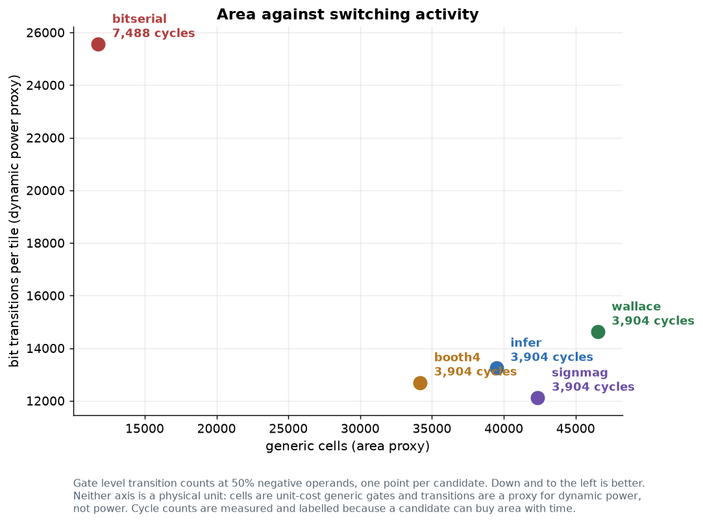

# matmul-ppa-testchip

An open-source ASIC test chip that measures the power, performance and area of
competing INT8 matrix-multiply microarchitectures: on the same die, under the same
workload, with the same measurement.

[](https://github.com/danieltyukov/matmul-ppa-testchip/actions/workflows/lint.yml)
[](https://github.com/danieltyukov/matmul-ppa-testchip/actions/workflows/sim.yml)
[](https://github.com/danieltyukov/matmul-ppa-testchip/actions/workflows/synth.yml)
[](LICENSE)

Target: IHP SG13G2 130 nm open-source PDK. Flow: Yosys and OpenROAD. RTL:
synthesisable SystemVerilog. Verification: cocotb with real assertions.

---

## The question

Anyone building an INT8 accelerator has to pick a multiplier. The textbooks offer
Wallace trees, Booth recoding, bit-serial arrays, and the option of writing `*` and
letting the synthesiser decide. The literature offers numbers from different
processes, tile sizes, accumulator widths and workloads, which makes them close to
incomparable.

This chip settles it for one process and one tile size. Five candidate
microarchitectures sit on the same die behind an identical interface, selectable at
runtime. The chip runs the same 32x32x32 INT8 GEMM through each of them, reports
cycles, MAC count, area and switching activity, and checks every result against a
golden matrix with an on-chip comparator.


## The candidates

| # | Module | Approach | Latency |
|---|---|---|---|
| 0 | `engine_infer` | `*` and `+`, so Yosys and ABC choose the structure. The control point. | 1 cycle |
| 1 | `engine_wallace` | Explicit signed partial products, 3:2 carry-save reduction tree | 1 cycle |
| 2 | `engine_booth4` | Radix-4 modified Booth recoding, then the same tree | 1 cycle |
| 3 | `engine_signmag` | Sign-magnitude datapath: unsigned magnitude array, sign applied once | 1 cycle |
| 4 | `engine_bitserial` | No multiplier. Horner's method over 8 bit planes | 8 cycles |

Every candidate is hand-written and builds from this repository with nothing but
Verilator, Icarus and Yosys. There is no external generator, no private tool, and no
committed netlist you cannot regenerate. Adding a sixth candidate touches five files:
[docs/ADDING_A_CANDIDATE.md](docs/ADDING_A_CANDIDATE.md).

---

## Results

All measured, all committed under `results/`, all charts regenerated from those files
by `make images`. Read [docs/PPA_METHODOLOGY.md](docs/PPA_METHODOLOGY.md) for exactly
what each number does and does not mean.

### PPA per candidate

Area from Yosys generic synthesis. Cycles and MACs read out of the chip's own
performance counters over SPI. Switching activity from gate level simulation at an
even operand sign mix.

| Candidate | Cells | Gate equivalents | Logic depth | Cycles | MACs/cycle | Transitions/tile |
|---|---|---|---|---|---|---|
| `engine_infer` | 39,482 | 79,683 | 51 | 3,904 | 8.39 | 13,251 |
| `engine_wallace` | 46,526 | 89,590 | 53 | 3,904 | 8.39 | 14,630 |
| `engine_booth4` | 34,169 | 71,648 | 52 | 3,904 | 8.39 | 12,698 |
| `engine_signmag` | 42,361 | 82,184 | 59 | 3,904 | 8.39 | 12,118 |
| `engine_bitserial` | 11,760 | 27,768 | 59 | 7,488 | 4.38 | 25,561 |

### Real PDK cell area

Mapped to the IHP SG13G2 standard cell library (`sg13g2_stdcell_typ_1p20V_25C`,
revision 0.1.4), so this is area in square micrometres rather than a gate count:

| Candidate | Cells | Cell area | Relative | Area per MAC |
|---|---|---|---|---|
| `engine_infer` | 35,917 | 392,529 um2 | 1.20x | 6,133 um2 |
| `engine_wallace` | 39,795 | 406,835 um2 | 1.24x | 6,357 um2 |
| `engine_booth4` | 30,389 | **328,163 um2** | **1.00x** | **5,127 um2** |
| `engine_signmag` | 38,390 | 387,504 um2 | 1.18x | 6,055 um2 |
| `engine_bitserial` | 13,143 | 149,875 um2 | 0.46x | 2,342 um2 |

The generic and PDK rankings agree, which is the useful part: Booth is smallest,
Wallace is largest, bit-serial is less than half of anything else, and the ordering
does not depend on the cost model. At 64 MACs per launch, `engine_booth4` costs about
5,100 square micrometres per MAC in 130 nm.

**This is standard cell area, not die area.** No place and route has been run, so
routing, filler, tap cells, the power grid and the pad frame are all excluded. A real
die is substantially larger. The liberty file is not vendored in this repository;
`tools/fetch_pdk.sh` downloads it and `make synth-pdk` reproduces the table.


What the area column says: **Booth recoding wins on area, and a hand-written Wallace
tree does not beat the synthesiser.** `engine_booth4` is 27 percent smaller than
`engine_wallace` and 13 percent smaller than `engine_infer`, which is what halving the
partial product count should buy. But `engine_wallace` is 18 percent *larger* than the
inferred baseline: ABC's own multiplier mapping beats an explicit 3:2 tree handed to
it. That is a useful negative result for anyone tempted to hand-write a Wallace tree
in 2026. `engine_bitserial` is 3.4 times smaller than anything else and pays for it
with 1.92 times the cycles.

Cycles are identical for the four single-cycle candidates, and exactly as the
sequencer model predicts:

```
per k tile = (max(TILE_M, TILE_K) + 1) + 1 + L = 5 + 1 + L
per o tile = 1 + GRID_K * (per k tile) + TILE_M
total      = GRID_M * GRID_N * (per o tile)
           = 64 * (1 + 8 * 7 + 4)  = 3904   for L = 1
           = 64 * (1 + 8 * 14 + 4) = 7488   for L = 8
```

`test_perf_counters` asserts measured against predicted, and the latency `L` it uses
is itself measured at the engine harness level rather than assumed.

### The sign-magnitude hypothesis

Candidate 3 exists to test one claim: that converting operands from two's complement
to sign-magnitude before the multiplier array reduces switching activity, because in
two's complement a value crossing zero flips every high-order bit while in
sign-magnitude it flips one sign bit.

`engine_signmag` and `engine_wallace` share the same 3:2 reduction tree and the same
final adder. They differ only in operand encoding. So the gap between them is the
encoding and nothing else.


Gate level bit transitions per tile, 48 tile launches per point, identical operand
streams across candidates:

| Negative operands | infer | wallace | booth4 | signmag | bitserial | signmag vs wallace |
|---|---|---|---|---|---|---|
| 0.0% | 8,772 | 9,816 | 10,861 | 10,594 | 18,683 | **+7.9%** |
| 24.7% | 11,858 | 12,912 | 12,301 | 11,808 | 23,736 | **-8.6%** |
| 50.1% | 13,251 | 14,630 | 12,698 | 12,118 | 25,561 | **-17.2%** |
| 73.8% | 13,712 | 15,210 | 12,459 | 11,827 | 25,365 | **-22.2%** |
| 100.0% | 13,570 | 14,846 | 11,164 | 10,607 | 23,424 | **-28.6%** |

**The hypothesis holds, with one honest caveat.** Sign-magnitude encoding cuts
switching activity by 8.6 to 28.6 percent against the identical two's complement
datapath, and the saving grows with the fraction of negative operands, exactly as the
mechanism predicts. At 25 percent negatives and above, `engine_signmag` is the
lowest-activity candidate on the chip.

The caveat: when every operand is non-negative, sign-magnitude **costs** 7.9 percent.
The converters and the extra magnitude bit are pure overhead when no sign ever
changes. So the encoding is a win for signed activations and weights that straddle
zero, and a loss for a post-ReLU unsigned stream. That distinction does not appear in
a single-number benchmark, which is why the sweep exists.

The mechanism is visible directly in the numbers. `engine_wallace` activity rises 51
percent from an all-positive stream to an all-negative one (9,816 to 14,846), which is
the two's complement sign extension cost. `engine_signmag` is nearly flat, peaking
only 14 percent above its minimum. That divergence is the effect the candidate was
built to measure.


The Pareto view the chip exists to produce:



Reading it: `engine_booth4` and `engine_signmag` are the two candidates on the
frontier. Booth is smaller, sign-magnitude is quieter, and which one you want depends
on whether your operands cross zero. `engine_wallace` is dominated on both axes and is
not worth building. `engine_bitserial` is off the frontier on activity but wins area
by a factor of three, which is the right trade when area is the binding constraint and
1.9 times the latency is acceptable.

**This is a switching-activity proxy, not power.** It counts bit transitions on gate
level nets weighted by Hamming distance. It weights every net equally regardless of
capacitance, does not capture glitch power (the gate level simulation has zero cell
delays, which systematically favours deep combinational designs), and ignores clock
tree, memory and leakage entirely. It is a relative ranking under a fixed workload,
which is the question that matters when choosing between candidates, and it is not
watts. The full list of biases is in
[docs/PPA_METHODOLOGY.md](docs/PPA_METHODOLOGY.md#what-the-proxy-does-not-tell-you).

### Whole chip

| Scope | Cells | Flip-flops |
|---|---|---|
| `engine_array` (all five candidates plus gating and isolation) | 232,071 | 2,841 |
| `bench_core` | 412,685 | 85,577 |
| `gemm_bench_chip` | 412,687 | 85,577 |

`engine_array` is 232,071 cells against 174,298 for the five candidates on their own.
The 58,000 cell difference is the clock gating and operand isolation that makes the
measurement valid, charged to shared logic rather than to any candidate. A production
accelerator with one datapath would not pay it.

The flip-flop count jumps at `bench_core` because Yosys maps the four matrix stores
(74 kbit in total) to flip-flops: this build binds no SRAM macros. A macro-backed
build replaces those with four compiled SRAM cuts at a fraction of the area.
`rtl/lib/sram_1rw.sv` is the binding point.


**That figure is an area estimate, not a layout.** OpenROAD and the IHP SG13G2
physical views are not installed in the environment this repository was developed in,
so no place and route has been run and there is no GDS. The block sizes are
proportional to synthesised cell counts and the positions are arbitrary. The complete
OpenROAD script sequence and the SDC constraints are committed in `flow/` and
`constraints/` and have never been executed; see
[what has and has not been run](docs/PPA_METHODOLOGY.md#what-has-and-has-not-been-run).

---

## Verification

Everything below genuinely ran, on Icarus Verilog 12.0 through cocotb 2.0.1.

| Suite | Result | Scale |
|---|---|---|
| `test_engine_exact` | 6/6 pass | 2,000 randomised tile launches across five operand distributions = 10,000 candidate evaluations and 160,000 element comparisons, plus 11 INT8 corner cases |
| `test_engine_equiv` | 3/3 pass | 20,000 candidate pair comparisons (10 pairs x 2,000 launches), 110 corner comparisons, 8,192 multiplier operand pairs |
| `test_config` | 2/2 pass | geometry read back out of the chip and compared against the Python model |
| `test_spi_protocol` | 16/16 pass | every opcode, 11 unknown opcodes, 7 truncated frames, a mid-byte frame, offset writes, address range violations, 48 back-to-back frames, commands during a run, soft reset, four SPI clock ratios |
| `test_end_to_end` | 6/6 pass | full 4 KiB result readback checked element by element, on-chip comparator agreement, 6 deliberately corrupted reference elements all localised, all five candidates through the whole chip |
| `test_perf_counters` | 5/5 pass | measured cycles equal the analytic model exactly for every candidate, MAC count exactly 32,768, cycle count data independent |
| `test_tiling` | 5/5 pass | coordinate-dependent operands, 6 single-tile positions, all 8 K tiles proved to contribute exactly once on every candidate, boundary tiles, repeated-run idempotence |
| `test_reset_gating` | 6/6 pass | reset state, reset mid-run, per-candidate clock gating, operand isolation, test mode, candidate switching |
| Verilator lint | 0 warnings | `-Wall` on the chip with no waivers of any kind, and on the engine harness with `UNUSEDPARAM` waived because that verification-only top uses none of the host-interface constants |
| Yosys synthesis | pass | 8 tops, no inferred latches, `check -assert` clean, no blackboxes |
| Gate level equivalence | pass | all five synthesised netlists checked against a reference before their activity is counted |

Total: 49 cocotb tests, all passing. The two slowest suites (`test_tiling` at 20
minutes and `test_reset_gating` at 12 minutes on Icarus) are what make `make sim` a
coffee break rather than a keystroke; `make sim-quick` is the reduced sweep CI runs.

```bash
make lint      # Verilator -Wall, must be zero warnings
make sim       # the full suite
make sim-quick # reduced sweep, what CI runs
```

The reference model is NumPy with an explicit INT64 accumulator wrapped to INT32. It
does not mirror RTL structure, so a shared misunderstanding cannot make a test pass.
Cross-candidate equivalence is checked separately, because a common-mode error in the
model would pass every comparison against it. The full plan is in
[docs/VERIFICATION_PLAN.md](docs/VERIFICATION_PLAN.md).

---

## Control plane

SPI Mode 0, MSB first, chip select active low, `f_spi <= f_core/8`. The pins are
oversampled in the core clock domain rather than used as a clock, so the whole chip is
single-clock and there is no clock domain crossing to verify.


That waveform is a real captured frame: `test_capture_timing_trace` samples the pins
on every core clock edge and writes `results/trace/spi_frame.json`, and the figure is
drawn from that file.


Fifteen opcodes cover loading operands and a golden reference, selecting a candidate,
clearing, triggering, verifying, reading the result, reading the performance counters
and the status byte, geometry discovery, and a keyed soft reset. Errors are reported
rather than swallowed: unknown opcodes, out-of-range addresses, truncated frames and
commands issued while busy all set sticky status bits. Full table in
[docs/MEMORY_MAP.md](docs/MEMORY_MAP.md).

`OP_RD_CFG` returns the build's geometry, so host tooling sizes its transfers from the
chip rather than from a compile-time constant. A fork that changes `MAT_*` or `TILE_*`
does not need to change its host software.

---

## Dataflow


One trigger runs the whole product. The accumulator for each output tile stays
resident while all `GRID_K` K-tiles stream through it, so no partial sum ever leaves
the accumulator registers.

The operand SRAM words are cut so that one word is exactly the slice of a matrix row a
tile fetch needs, which makes a tile fetch `TILE_M` (or `TILE_K`) single-port reads
rather than one implausibly wide access. Five of the seven cycles per K-tile are
operand fetch, and that cost is real: a design that pretends a single-port SRAM has a
wide port measures a memory system that cannot be built.
[docs/ARCHITECTURE.md](docs/ARCHITECTURE.md) has the rest.

---

## Getting started

```bash
git clone https://github.com/danieltyukov/matmul-ppa-testchip.git
cd matmul-ppa-testchip
make venv           # .venv with cocotb, numpy, matplotlib
make check-tools    # reports what is present and what is missing
make lint sim       # lint and the full test suite
make synth power    # area and the switching-activity proxy
make images         # regenerate every figure from results/
```

Needed, and verified working: Verilator 5.020 (lint), Icarus Verilog 12.0
(simulation), Yosys 0.33 (synthesis), Python 3.12.

Verilator would be the faster cocotb backend, but cocotb 2.0 requires Verilator 5.036
and the toolchain here is 5.020, so Icarus runs the tests and Verilator does lint.
Setting `SIM=verilator` in `tb/Makefile` is the only change needed once a newer
Verilator is available.

### What needs the IHP PDK

| Target | Needs the PDK | Status here |
|---|---|---|
| `make lint` | no | run, zero warnings |
| `make sim` | no | run |
| `make synth` | no | run, reports committed |
| `make power` | no | run, results committed |
| `make images` | no | run, figures committed |
| `make synth-pdk` | yes, `SG13G2_LIB` | run, results committed under `results/synth/sg13g2/` |
| `make flow` | yes, plus OpenROAD | **not run: OpenROAD is not installed and the physical views are unavailable** |

```bash
tools/fetch_pdk.sh        # sparse clone of the views the flow needs
source pdk/env.sh
make synth-pdk            # real cell area in square micrometres
make flow                 # place and route, untested here
```

`tools/fetch_pdk.sh` does not vendor the PDK. It is a large Apache-2.0 third-party
artefact with its own release cadence, and a committed copy would go stale.

---

## Repository layout

```
rtl/
  pkg/        gemm_pkg.sv, the single source of truth for every dimension
  lib/        synchroniser, reset bridge, clock gate, SRAM technology wrapper
  host/       spi_target, frame_router
  mem/        matrix_store: word and byte views on one single-port SRAM
  engines/    the five candidates, plus the shared CSA tree and accumulator bank
  seq/        gemm_sequencer, engine_array
  measure/    cycle_meter, mac_meter, result_checker
  top/        bench_core, pad_frame, gemm_bench_chip
tb/           cocotb suite, the NumPy reference model, the SPI driver, SV benches
tools/        synthesis collection, VCD activity proxy, figure generators,
              and program_chip.py: the host driver for packaged silicon
flow/         Yosys script and the PDK-gated OpenROAD sequence
constraints/  clocks, IO and area SDC
results/      every measurement the README and the figures are built from
docs/         architecture, memory map, PPA methodology, verification plan,
              and the guide for adding your own candidate
```

## Bringing up silicon

`tools/program_chip.py` drives the packaged chip from Linux spidev with the same
command sequences the tests use, sharing its frame construction with the testbench
through `tb/gemm_model.py` so a protocol change cannot make the two disagree silently.

```bash
tools/program_chip.py info                    # identify the chip, report its geometry
tools/program_chip.py bench --engine 1        # one candidate, checked on chip
tools/program_chip.py sweep --clock-hz 50e6   # every candidate, PPA table
tools/program_chip.py read-c --out result.npy
```

It has never been run against silicon, because nothing has been fabricated.

## Documentation

- [docs/ARCHITECTURE.md](docs/ARCHITECTURE.md): the design, and why each decision was taken
- [docs/MEMORY_MAP.md](docs/MEMORY_MAP.md): the SPI command set, register maps and worked sequences
- [docs/PPA_METHODOLOGY.md](docs/PPA_METHODOLOGY.md): how every number is produced and what it does not mean
- [docs/VERIFICATION_PLAN.md](docs/VERIFICATION_PLAN.md): every test and what it establishes
- [docs/ADDING_A_CANDIDATE.md](docs/ADDING_A_CANDIDATE.md): drop in your own microarchitecture
- [CONTRIBUTING.md](CONTRIBUTING.md)

## Honesty notes

Collected in one place, because a benchmark repository that overstates its numbers is
worse than no benchmark at all.

- **No layout exists.** OpenROAD and the SG13G2 physical views are not installed here.
  `docs/img/floorplan_estimate.png` is a cell-count treemap, labelled as an estimate
  on its face.
- **Yosys generic cell counts are not PDK area.** They are unit-cost gates. Gate
  equivalents weight them by static CMOS transistor counts, which is technology
  independent and still not area.
- **The SG13G2 numbers are real cell area and still not die area.** They exclude
  routing, filler, tap cells, the power grid and the pad frame, all of which place and
  route adds.
- **Logic depth is a gate count, not a delay.** No cell timing is involved.
- **The power number is a transition count, not watts.** Its known biases are listed in
  the methodology document, with glitch power called out as the largest.
- **The 50 MHz clock target in the SDC is not a measured maximum frequency.** No timing
  analysis has been run.
- **Nothing has been fabricated.**

## Licence

Apache-2.0. Copyright 2026 Daniel Tyukov. See [LICENSE](LICENSE).
