# matmul-ppa-testchip

An open-source ASIC test chip that measures the power, performance and area of
competing INT8 matrix-multiply microarchitectures: on the same die, under the same
workload, with the same measurement, through the same flow, to a routed GDS.

[](https://github.com/danieltyukov/matmul-ppa-testchip/actions/workflows/lint.yml)
[](https://github.com/danieltyukov/matmul-ppa-testchip/actions/workflows/sim.yml)
[](https://github.com/danieltyukov/matmul-ppa-testchip/actions/workflows/synth.yml)
[](LICENSE)

Target: IHP SG13G2 130 nm open-source PDK. Flow: Yosys, OpenROAD and LibreLane, to a
DRC and LVS clean GDS. RTL: synthesisable SystemVerilog. Verification: cocotb with real
assertions, run again on the routed netlist.

---

## The question

Anyone building an INT8 accelerator has to pick a multiplier. The textbooks offer
Wallace trees, Booth recoding, bit-serial arrays, and the option of writing `*` and
letting the synthesiser decide. The literature offers numbers from different processes,
tile sizes, accumulator widths and workloads, which makes them close to incomparable.

This chip settles it for one process and one tile size. Five candidate
microarchitectures sit on the same die behind an identical interface, selectable at
runtime. The chip runs the same 32x32x32 INT8 GEMM through each of them, reports
cycles, MAC count and switching activity, and checks every result against a golden
matrix with an on-chip comparator. Each candidate is then placed and routed on its own
at an identical clock constraint, so the area and frequency numbers are physical rather
than estimated.

There is a second, narrower question underneath it, and it is the reason candidate 3
exists: **does sign-magnitude operand encoding actually reduce power?** The answer is in
[the sign-magnitude result](#the-sign-magnitude-result), and it is a qualified no as
often as it is a yes.

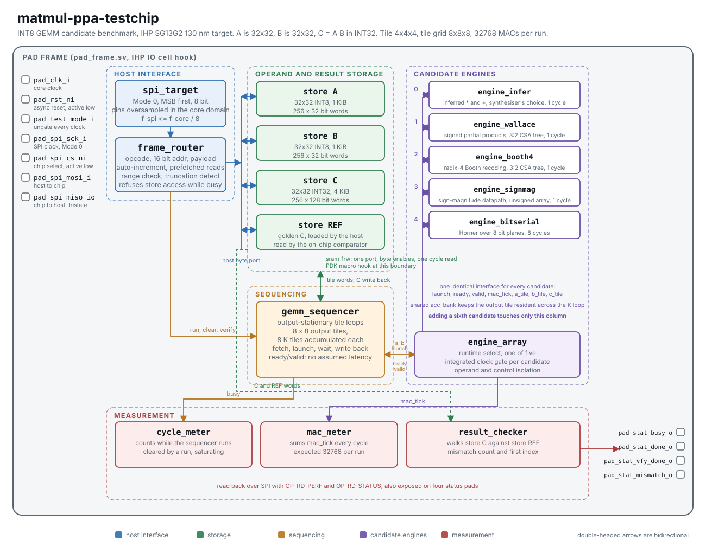

## The candidates

| # | Module | Approach | Latency |
|---|---|---|---|
| 0 | `engine_infer` | `*` and `+`, so Yosys and ABC choose the structure. The control point. | 1 cycle |
| 1 | `engine_wallace` | Explicit signed partial products, 3:2 carry-save reduction tree | 1 cycle |
| 2 | `engine_booth4` | Radix-4 modified Booth recoding, then the same tree | 1 cycle |
| 3 | `engine_signmag` | Sign-magnitude datapath: unsigned magnitude array, sign applied once | 1 cycle |
| 4 | `engine_bitserial` | No multiplier. Horner's method over 8 bit planes | 8 cycles |

Two more scopes are measured alongside them, because a candidate in isolation is not the
whole story:

| Scope | What it is | Why it is measured |
|---|---|---|
| `engine_array` | all five candidates, their clock gates and their operand isolation | the candidates in full-chip context, and the price of making the measurement valid |
| `bench_core` | the whole benchmark core: sequencer, stores, meters, SPI | where the memory cost shows up |

Every candidate is hand-written and builds from this repository with nothing but
Verilator, Icarus and Yosys. There is no external generator, no private tool, and no
committed netlist you cannot regenerate.

### What makes this a controlled experiment

Comparing microarchitectures is easy to do badly. Four things here exist specifically to
stop the comparison from being an anecdote:

1. **Identical interface.** Every candidate implements the same port list, so nothing
   about the surrounding design changes when the selection changes.
2. **Identical workload.** The same operand stream, from the same seed, reaches every
   candidate. The sweeps vary one property of the data at a time.
3. **Identical constraint through place and route.** Every candidate routes at the same
   20 ns period and the same 40 percent target utilisation. Closing each at its own best
   period would measure each under a different amount of optimisation pressure, which is
   exactly the confound worth removing.
4. **The costs land on whoever incurs them.** The sign-magnitude converters live inside
   `engine_signmag`, not in shared logic. Moving them out would have flattered the
   candidate this chip was built to test.

`engine_signmag` and `engine_wallace` go further and share the same `csa_reduce` tree and
the same final adder. The only difference between them is the operand encoding, so the
gap between them is the encoding and nothing else.

---

## Results

All measured, all committed under `results/`, all charts regenerated from those files by
`make images`. `make report` prints the tables below straight from the same JSON, which
is how they were checked. Read [docs/PPA_METHODOLOGY.md](docs/PPA_METHODOLOGY.md) for
exactly what each number does and does not mean.

### Post-route PPA per candidate

This is the headline table, and every column in it is physical. Area and frequency come
from LibreLane's own `final/metrics.json` after routing, not from synthesis. Power is
measured on the netlist the GDS was streamed from, with parasitics extracted from the
routing.

| Candidate | Routed cell area | Die area | Post-route Fmax | Power | Energy/tile | Cycles |
|---|---|---|---|---|---|---|
| `engine_infer` | 443,933 um2 | 0.939 mm2 | 81.4 MHz | 8.73 mW | 446 pJ | 3,904 |
| `engine_wallace` | 476,959 um2 | 0.994 mm2 | 77.9 MHz | 9.35 mW | 477 pJ | 3,904 |
| `engine_booth4` | **383,415 um2** | **0.796 mm2** | **83.0 MHz** | **8.21 mW** | **419 pJ** | 3,904 |
| `engine_signmag` | 394,146 um2 | 0.819 mm2 | 69.2 MHz | 8.41 mW | 429 pJ | 3,904 |
| `engine_bitserial` | 185,463 um2 | 0.356 mm2 | 77.3 MHz | 6.51 mW | 1,245 pJ | 7,488 |

All five candidates routed. Every one is clean: 0 Magic DRC errors, 0 KLayout DRC errors,
0 LVS errors and 0 routing DRC violations, with positive hold slack at every corner. A
handful of antenna violations survive, and they are reported rather than swept up. Power
is measured on each candidate's own routed netlist at 100 percent annotation coverage,
and each of those netlists was checked against the reference model before its power was
counted.

**Booth recoding wins outright.** Among the four single-cycle candidates it is
simultaneously the smallest die, the fastest at signoff and the lowest energy per tile.
That is unusual: area, speed and energy normally trade against one another, and halving
the partial product count improves all three at once. Against `engine_wallace` it is 20
percent smaller, 12 percent cheaper in energy and 6.5 percent faster.

**The hand-written Wallace tree is dominated on every axis.** Post-route it is 5.8
percent larger than the inferred baseline, uses 7.2 percent more energy, and is 4.2
percent slower. At synthesis it looked only 4 percent larger and the frequency question
was unanswerable. Routing settles it: ABC's own multiplier mapping beats an explicit 3:2
carry-save tree handed to it, and `engine_wallace` is the one candidate here not worth
building.

`engine_bitserial` draws the lowest power of anything here, 6.51 mW, and that is exactly
the trap described [below](#does-the-cheap-proxy-predict-real-power): it spends 7,488
cycles to everyone else's 3,904, so it uses **2.6 times the energy** of the Wallace tree
for the same work while drawing less power. Its die is 2.2 times smaller than the next
smallest, which is the reason to build it.

Synthesis cell area grows into routed cell area by 13 to 24 percent for most candidates,
and by only 1.7 percent for `engine_signmag`. The die is then roughly twice the routed
cell area again at 40 percent target utilisation. Compounding those, a die is 2.1 to 2.4
times the synthesis cell area, which is why synthesis area should never be quoted as a
die size.

<details>
<summary>Per-candidate route detail</summary>

| Candidate | Design cells | Fill cells | Utilisation | Wirelength | Synthesis to routed cell growth | Antenna |
|---|---|---|---|---|---|---|
| `engine_infer` | 37,459 | 52,867 | 49.6% | 1,284 mm | +13.1% | 9 |
| `engine_wallace` | 40,422 | 55,349 | 50.1% | 1,453 mm | +17.2% | 20 |
| `engine_booth4` | 31,710 | 44,280 | 50.6% | 1,120 mm | +16.8% | 21 |
| `engine_signmag` | 33,019 | 45,533 | 50.6% | 1,396 mm | +1.7% | 2 |
| `engine_bitserial` | 13,577 | 17,051 | 56.1% | 414 mm | +23.7% | 1 |

The two instance columns are split on purpose. LibreLane's `design__instance__count` is
the total and it is **more than half fill** for every candidate here, because fill cells
exist to satisfy density rules and are not the design. The area columns everywhere in
this README exclude fill, so quoting the combined instance count next to them would
compare two different things. The die renders label the design cell count for the same
reason.

Growth is measured against `results/synth/sg13g2/summary.json`. That file and
`results/pdk/summary.json` both report SG13G2 cell area for the same RTL and disagree by
about 1 percent, which is not an error in either: the first maps at the typical corner
and `tools/pdk_ppa.py` maps at the slow corner, and ABC picks different cells when the
cell delays change. `engine_wallace` is 406,886 um2 at typical and 403,449 um2 at slow.
Quote one, and say which.

</details>

#### The flow is deterministic, so these differences are real

`engine_bitserial` was routed a second time from the identical committed configuration,
on a machine that was running three other place and route jobs at the time. Comparing
every key in the two `final/metrics.json` files:

```
differing keys: 0 out of 191
```

Identical worst setup slack at all three corners to the last digit of a double, identical
routed cell area, die area, wirelength, via count, power, and identical DRC, LVS and
antenna counts. LibreLane pins its tool seeds. **Nothing in the table above is
run-to-run noise**, so the differences between candidates are differences between
designs.

That matters because an earlier trial of the same candidate did report 67.1 MHz rather
than 77.3, and it would have been easy to write that down as tool variance. It was not.
That run used an earlier `constraints/block.sdc` whose IO budget was a fraction of the
clock period, `period * 0.2`, or 4 ns at 20 ns. Two things were wrong with it: the design
lost 3 ns of external budget it did not need to lose, and `1/(period - slack)` stops
being the right arithmetic when the slack moves with the period for two reasons at once.
The committed SDC fixes the budget at 1 ns, and the 1.98 ns of critical path between the
two runs tracks that 3 ns constraint change rather than any nondeterminism.

Fmax is `1/(period - worst setup slack)` from signoff STA at `nom_slow_1p08V_125C`, the
corner a tapeout closes at. That arithmetic is exact rather than approximate because
`constraints/block.sdc` fixes the IO budget at 1 ns instead of taking a fraction of the
clock period, so nothing in the constraint moves when the period does.

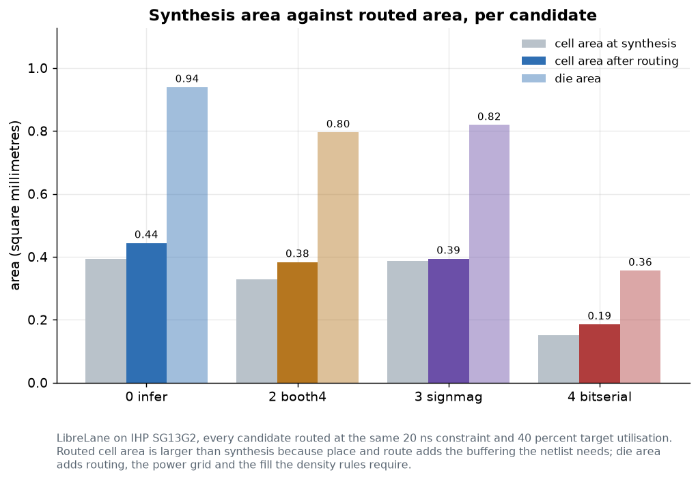

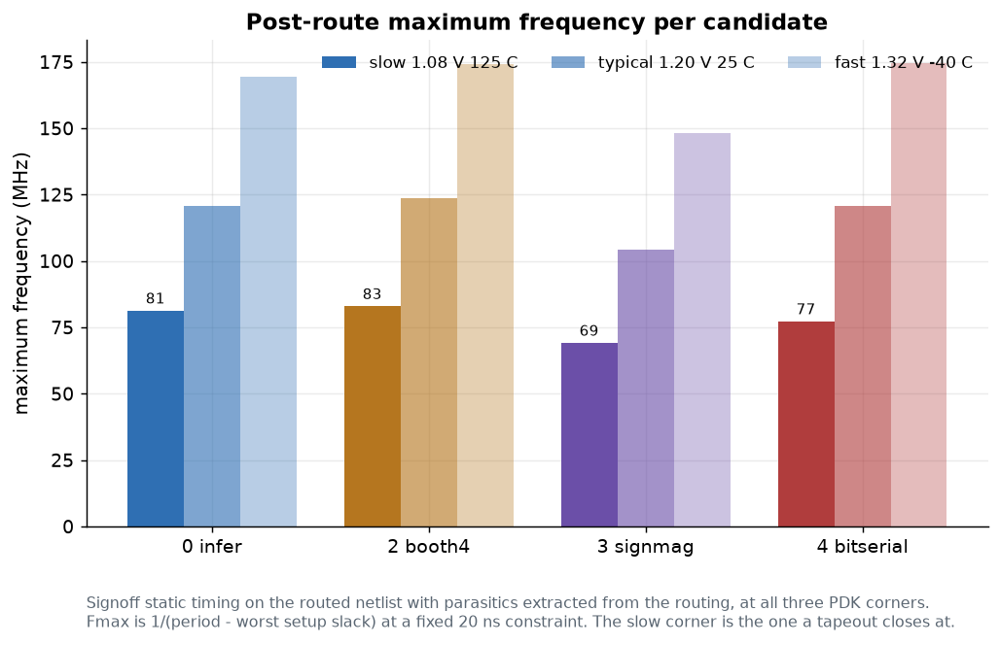

Three area numbers come out of routing and they mean different things. Confusing them is
the easiest way to overstate a result:

- **Routed cell area** (`design__instance__area__stdcell`) is the design's own cells after
  routing. It is larger than the synthesis figure because place and route inserts the
  buffering the netlist actually needs and the resizer upsizes cells to meet timing. That
  growth is not waste: a synthesis netlist with a 512-way unbuffered net is not a design
  that can be built.
- **Instance area** adds the fill cells that exist only to satisfy density rules. Never
  compare this against synthesis.
- **Die area** is the die, including routing, the power grid, the fill and the margin
  around the core at the configured utilisation.

### What the same function looks like in silicon

Five functionally equivalent engines, the same flow, the same 20 ns constraint, rendered
at one scale so the size difference is a difference on the page rather than a number in a
table.

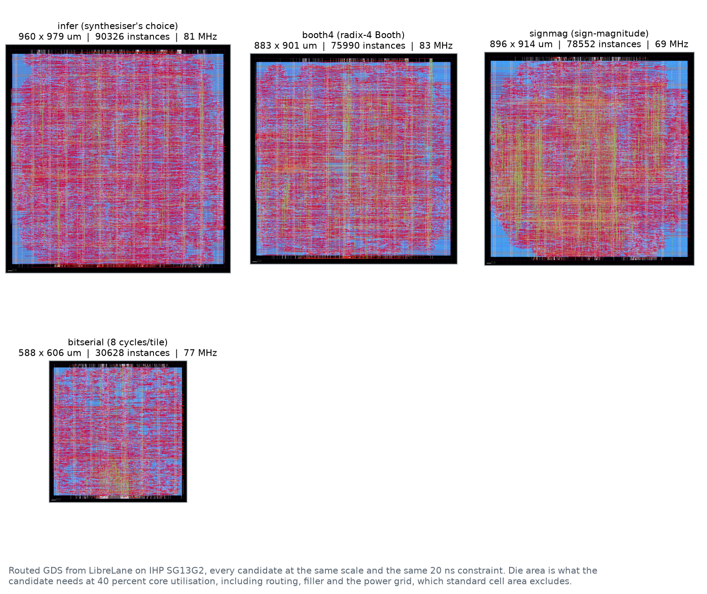

The bit-serial engine is the obvious one: a third of the die of anything else, because it
has no multiplier array at all. Less obvious is the difference in core shape.
`engine_booth4` places as a clean rectangular mat, while `engine_wallace` and
`engine_signmag` both have visibly ragged, rounded core edges where the placer could not
square the design off.

`engine_signmag` is the one where that costs something measurable. It routes **25 percent
more wire than Booth for 3 percent more instances**, 17.8 micrometres of wire per instance
against Booth's 14.7, the highest of any candidate. Operand conversion feeds the whole
array from one place and does not tile the way recoded partial products do. That wire is
where a good part of its frequency went.

The zoom sheet takes the same 60 micrometre square from the middle of each core at one
magnification, and its result is a negative one worth keeping:

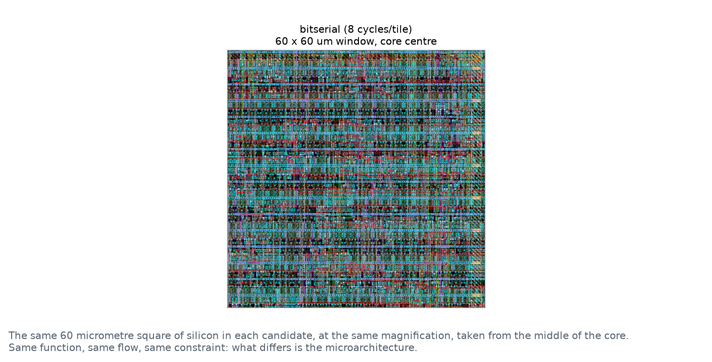

At that magnification all five look alike, because they are the same standard cell
library placed in the same cell rows by the same router. There is no visible signature of
a Wallace tree or a Booth recoder in a square of silicon. The microarchitecture shows up
in **how much** of this a candidate needs, which is the die sheet above, not in what any
one piece of it looks like.

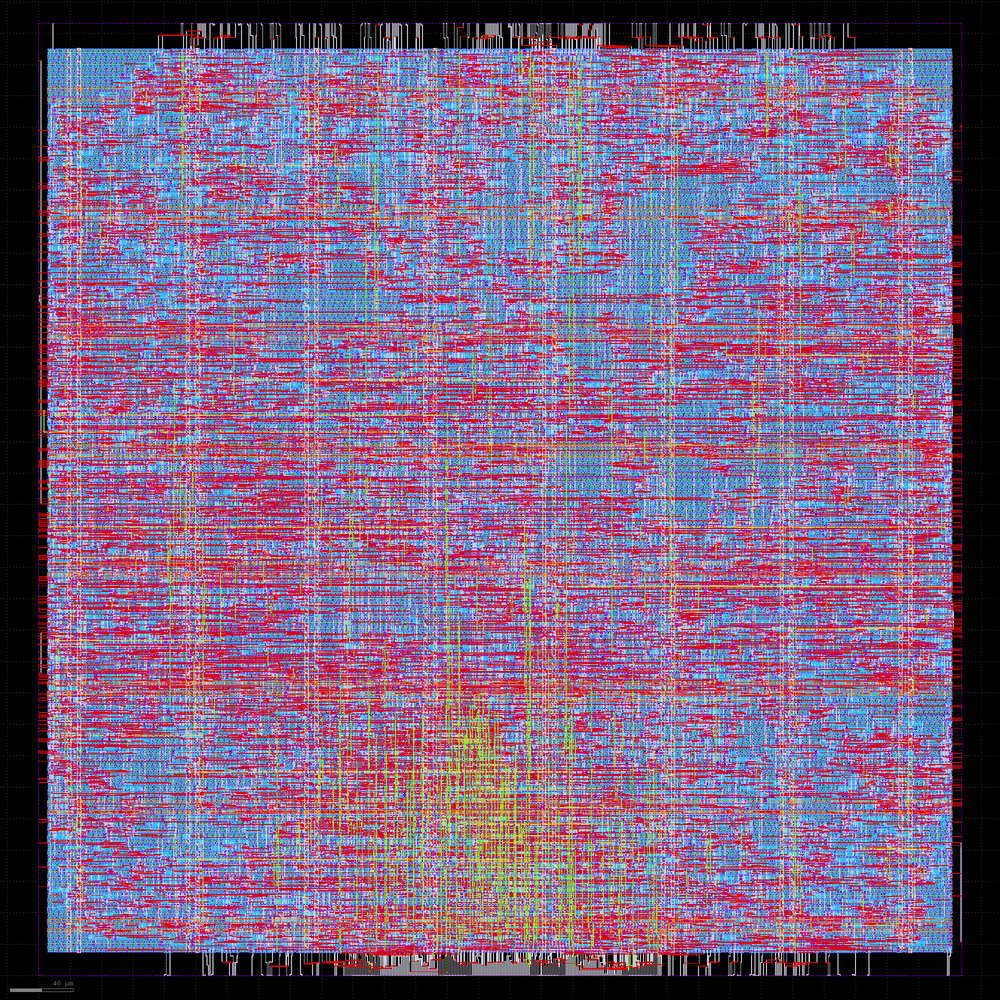

These are rendered from the routed GDS by `tools/render_gds.py` driving KLayout with the
PDK's own layer properties. If a GDS is missing the script says so rather than drawing
something that looks like a layout and is not one.

### Technology-independent PPA

Yosys generic synthesis, before any PDK is involved. Useful because the ranking it
produces is not a property of one library's cost model.

| Candidate | Cells | Gate equivalents | Logic depth | Cycles | MACs/cycle | Transitions/tile |
|---|---|---|---|---|---|---|
| `engine_infer` | 39,482 | 79,683 | 51 | 3,904 | 8.39 | 13,251 |
| `engine_wallace` | 46,526 | 89,590 | 53 | 3,904 | 8.39 | 14,630 |
| `engine_booth4` | 34,169 | 71,648 | 52 | 3,904 | 8.39 | 12,698 |
| `engine_signmag` | 42,361 | 82,184 | 59 | 3,904 | 8.39 | 12,118 |
| `engine_bitserial` | 11,760 | 27,768 | 59 | 7,488 | 4.38 | 25,561 |

Gate equivalents weight each cell by its static CMOS transistor count, so a XOR-heavy
design costs more than an AND-heavy one of the same cell count. That is technology
independent and it is still not area. Logic depth is a count of gate levels, not a
delay.

### Real PDK cell area at synthesis

Mapped to the IHP SG13G2 standard cell library, so this is square micrometres rather than
a gate count. It is the number to compare against the routed cell area above, and the gap
between the two is what place and route adds.

| Candidate | Cells | Cell area | Relative | Area per MAC |
|---|---|---|---|---|
| `engine_infer` | 35,924 | 392,580 um2 | 1.20x | 6,134 um2 |
| `engine_wallace` | 39,802 | 406,886 um2 | 1.24x | 6,358 um2 |
| `engine_booth4` | 30,396 | **328,214 um2** | **1.00x** | **5,128 um2** |
| `engine_signmag` | 38,397 | 387,555 um2 | 1.18x | 6,056 um2 |
| `engine_bitserial` | 13,149 | 149,918 um2 | 0.46x | 2,342 um2 |

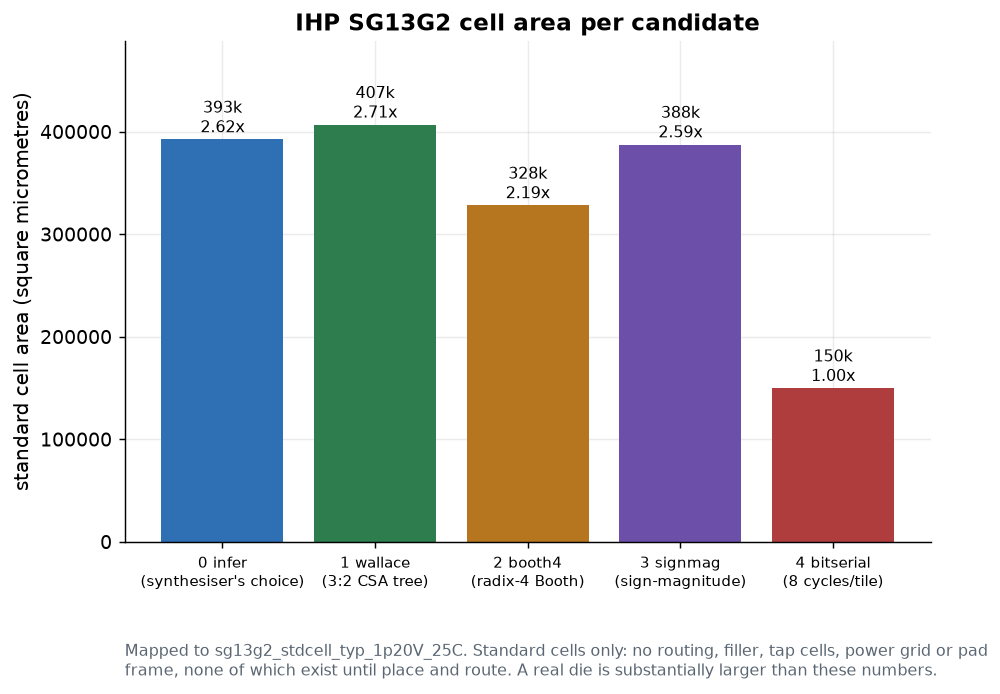

**Booth recoding wins on area.** `engine_booth4` is 19 percent smaller than
`engine_wallace` and 16 percent smaller than `engine_infer`, which is roughly what halving
the partial product count should buy. `engine_bitserial` is 2.2 times smaller than
anything else and pays for it with 1.92 times the cycles.

The Wallace result is more interesting than a single ratio suggests, and it is worth
being careful about which cost model is talking. Counting generic cells,
`engine_wallace` is 18 percent larger than the inferred baseline, which reads as a clear
loss for hand-writing a reduction tree. Measured in real SG13G2 area it is only **4
percent larger**. The gap between those two figures is the point: generic cell counting
treats every cell as equally expensive, and a real library maps a carry-save tree onto
cells that are cheaper per cell than the count implies.

So the honest version of the claim is narrower than "do not hand-write a Wallace tree".
ABC's own multiplier mapping is at least as good as an explicit 3:2 tree handed to it,
and on real area the two are within a few percent. What is not close is Booth: halving
the partial products is worth about a fifth of the area against either of them, and that
holds in both cost models.

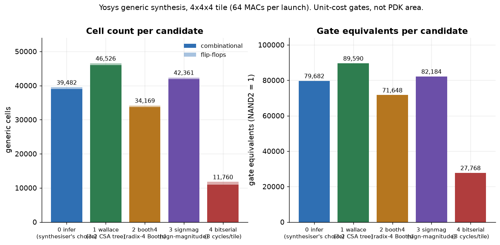

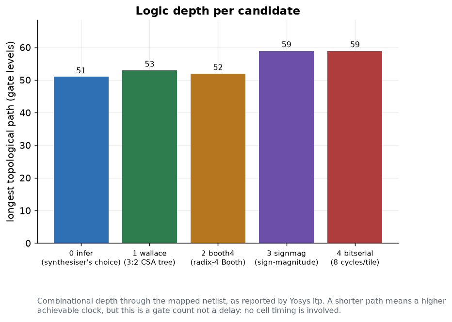

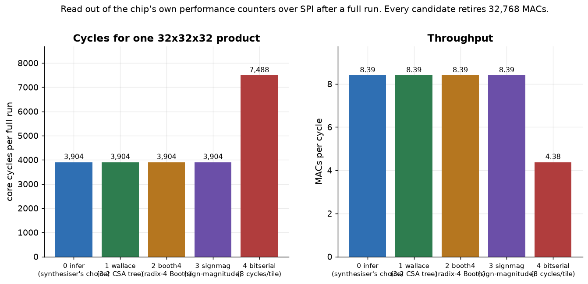

Cycles are identical for the four single-cycle candidates, and exactly as the sequencer
model predicts:

```
per k tile = (max(TILE_M, TILE_K) + 1) + 1 + L = 5 + 1 + L
per o tile = 1 + GRID_K * (per k tile) + TILE_M
total      = GRID_M * GRID_N * (per o tile)
           = 64 * (1 + 8 * 7 + 4)  = 3904   for L = 1
           = 64 * (1 + 8 * 14 + 4) = 7488   for L = 8
```

`test_perf_counters` asserts measured against predicted, and the latency `L` it uses is
itself measured at the engine harness level rather than assumed, so the check is not
circular.

### Where the frequency comes from

Three different frequencies appear in this repository and only one of them is the
design's. This table is here so they cannot be confused.

| Candidate | Netlist worst path | Limited by | Datapath path | Routed Fmax (slow) | Routed Fmax (typical) |
|---|---|---|---|---|---|
| `engine_infer` | 30.38 ns | `acc_clear_i` | 10.06 ns | 81.4 MHz | 120.7 MHz |
| `engine_wallace` | 30.38 ns | `acc_clear_i` | 10.46 ns | 77.9 MHz | 116.3 MHz |
| `engine_booth4` | 30.39 ns | `acc_clear_i` | 11.85 ns | 83.0 MHz | 123.6 MHz |
| `engine_signmag` | 30.39 ns | `acc_clear_i` | 12.08 ns | 69.2 MHz | 104.2 MHz |
| `engine_bitserial` | 66.24 ns | `_25522_` | 12.24 ns | 77.3 MHz | 120.6 MHz |

The synthesis column ranks the candidates almost identically and is wrong about all of
them. It puts every single-cycle candidate within 0.01 ns of 30.39 ns and `engine_infer`
ahead of `engine_signmag` on the datapath path by 2 ns; after routing they differ by 12
MHz in the opposite proportion. The synthesis number is measuring a control net that
place and route buffers away.

The first version of this measurement reported 32.9 MHz for four different multiplier
microarchitectures, within 15 picoseconds of each other. Four different multipliers
cannot have the same critical path. Two things were wrong, and both are worth knowing
about because the wrong number looks entirely plausible:

**Unconstrained inputs are invisible.** The SDC constrained the control ports but not
`a_tile_i` or `b_tile_i`. An input with no arrival time has no setup requirement, so
every path through the multiplier array was excluded from the analysis. What was being
timed was the control logic.

**A Yosys netlist has no buffering.** `acc_clear_i` reaches all 512 accumulator
flip-flops through one gate, which then takes 21 ns to drive them. That path is identical
in every candidate because the accumulator bank is shared, which is exactly why the four
numbers agreed. It is still the limiting path in the synthesis column above, and it is
why that column is not a frequency.

Place and route fixes this properly by buffering the net, which is why the routed number
is the design's and the synthesis number is not.

### The sign-magnitude result

Candidate 3 exists to test one claim: that converting operands from two's complement to
sign-magnitude before the multiplier array reduces switching activity, because in two's
complement a value crossing zero flips every high-order bit while in sign-magnitude it
flips one sign bit and leaves the magnitude alone.

The chip can now answer that in watts rather than in transition counts. Both engines are
synthesised to real SG13G2 cells, simulated under the identical operand stream, and their
power annotated from the VCD of that run at full coverage.

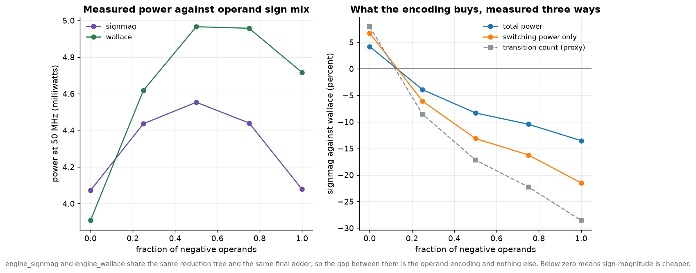

| Negative operands | wallace | signmag | Total power | Switching power | Transition count (proxy) |
|---|---|---|---|---|---|
| 0% | 3.908 mW | 4.072 mW | **+4.2%** | +6.8% | +7.9% |
| 25% | 4.618 mW | 4.437 mW | **-3.9%** | -6.1% | -8.6% |
| 50% | 4.966 mW | 4.554 mW | **-8.3%** | -13.1% | -17.2% |
| 75% | 4.958 mW | 4.440 mW | **-10.4%** | -16.2% | -22.2% |
| 100% | 4.717 mW | 4.078 mW | **-13.5%** | -21.5% | -28.6% |

**The hypothesis is confirmed in direction and substantially overstated in size, and it
is false at the one operating point most likely to matter.**

Taking those in order.

The mechanism is real. Sign-magnitude saves switching power, the saving grows
monotonically with the fraction of negative operands, and at an all-negative stream it
reaches 21.5 percent of switching power. The underlying effect is visible directly:
`engine_wallace` power rises 27 percent from an all-positive stream to its peak, which is
the two's complement sign extension cost, while `engine_signmag` rises only 12 percent.
That divergence is precisely what the candidate was built to detect.

The size is smaller than an activity-only study would claim. Switching power is not total
power. The converters and the wider magnitude datapath add internal and leakage power
that no transition count sees, so the 21.5 percent saving on switching power becomes 13.5
percent on total power, and the proxy's 28.6 percent becomes 13.5 percent. **A study that
stopped at transition counts would have overstated the benefit by a factor of two.**

And it loses where it probably matters most. At an all-positive operand stream
sign-magnitude **costs 4.2 percent**. The conversion hardware is pure overhead when no
sign ever changes. The crossover is near 13 percent negatives by linear interpolation
between the first two rows, so the encoding is a win for signed weights and activations
that straddle zero, and a loss for a post-ReLU unsigned activation stream. Post-ReLU
unsigned activations are extremely common in exactly the inference workloads an INT8
accelerator is built for.

#### What routing does to the result

Everything above is measured on the synthesis netlist. Both engines have since been
placed and routed at the identical constraint, which lets the same controlled comparison
run on real silicon geometry:

| `engine_signmag` against `engine_wallace`, post-route | |
|---|---|
| Routed cell area | **-17.4%** |
| Die area | **-17.6%** |
| Energy per tile | **-10.1%** |
| Average power | **-10.1%** |
| Maximum frequency | **-11.2%** (69.2 MHz against 77.9 MHz) |

**The encoding survives routing as a real win on area and energy, and it is paid for in
frequency.** Sign-magnitude is a sixth smaller and a tenth cheaper in energy than the
identical datapath in two's complement, which is a better area result than the activity
study predicted and a worse power result. What the synthesis sweep could not see at all
is the frequency: the conversion logic adds depth, and `engine_signmag` closes 11 percent
slower. At constant throughput that eats the power saving.

It also does not make the candidate competitive. `engine_booth4` beats it on all three
axes at once, being 2.8 percent smaller, 2.4 percent cheaper in energy and 20 percent
faster. Sign-magnitude beats the tree it was built to be compared against, and loses to
a better tree.

The honest summary: sign-magnitude encoding is worth about 10 percent of energy and 17
percent of area against an identical two's complement datapath, costs 11 percent of
frequency, is worth nothing like the 29 percent a transition count suggests, and is a net
power loss on unsigned data. Against the best candidate on this chip it is simply beaten.
Whether to use it is a question about your operand statistics and your timing slack, not
a question with one answer, and none of that distinction survives a single-number
benchmark.

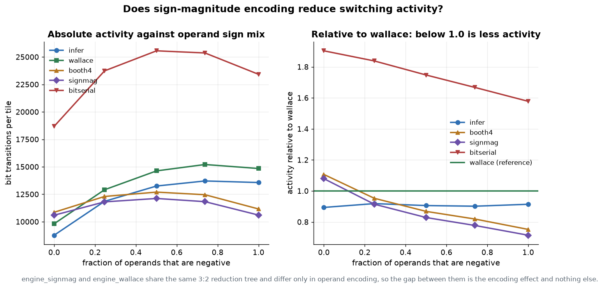

The transition-count sweep behind the last column, kept because it gives a per-module
breakdown that a power number does not:

| Negative operands | infer | wallace | booth4 | signmag | bitserial | signmag vs wallace |
|---|---|---|---|---|---|---|
| 0.0% | 8,772 | 9,816 | 10,861 | 10,594 | 18,683 | +7.9% |
| 24.7% | 11,858 | 12,912 | 12,301 | 11,808 | 23,736 | -8.6% |
| 50.1% | 13,251 | 14,630 | 12,698 | 12,118 | 25,561 | -17.2% |
| 73.8% | 13,712 | 15,210 | 12,459 | 11,827 | 25,365 | -22.2% |
| 100.0% | 13,570 | 14,846 | 11,164 | 10,607 | 23,424 | -28.6% |

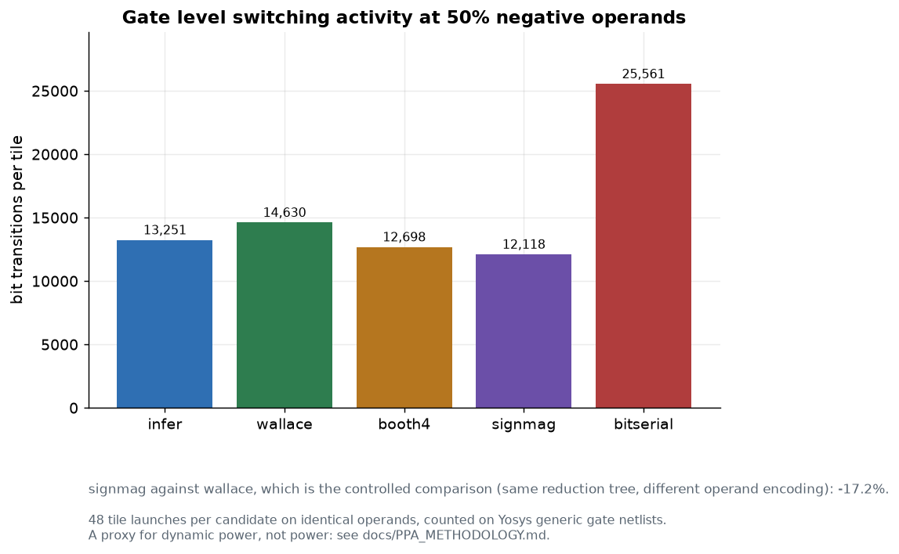

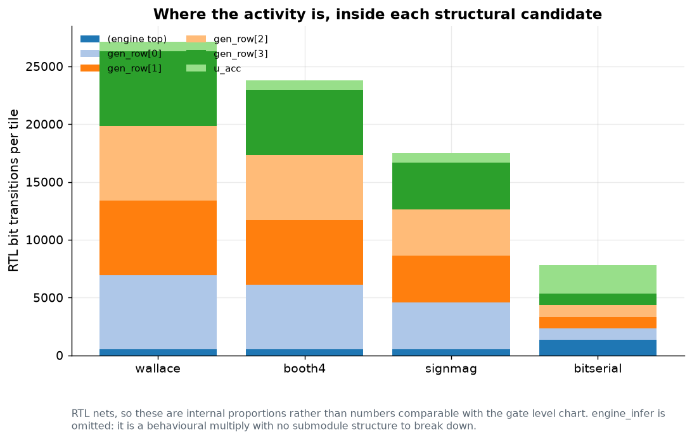

### Does the cheap proxy predict real power?

Counting bit transitions in a VCD is nearly free and needs no PDK. Annotated power needs
a liberty file, a gate level netlist and a signoff tool. If the free measurement predicts
the expensive one, most of this analysis is reproducible by anyone. So it is worth
checking directly rather than assuming.

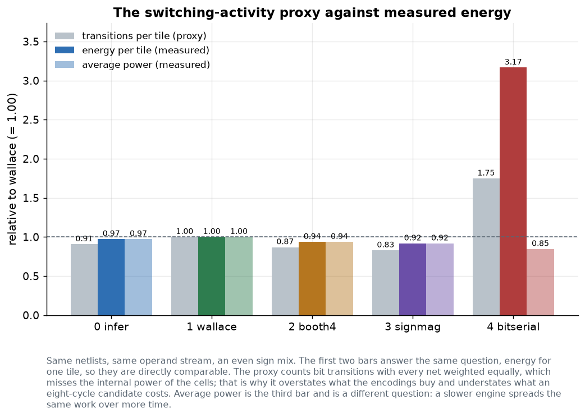

**Against the synthesis netlist the proxy ranks perfectly.** Rank correlation 1.00 across
all five candidates, linear correlation 0.99. That is the result an activity-only study
would report, and it is encouraging.

**Against the routed netlist it does not.** Rank correlation falls to 0.90, and the
single inversion is the one that matters: the proxy puts `engine_signmag` cheaper than
`engine_booth4`, and after routing Booth is cheaper. Those are the two candidates on the
Pareto frontier, so the proxy gets the ordering wrong at precisely the comparison a
designer would be using it to make.

Relative to `engine_wallace`:

| Candidate | Proxy says | Routed energy says | Proxy error |
|---|---|---|---|
| `engine_infer` | 0.91x | 0.93x | close |
| `engine_booth4` | 0.87x | 0.88x | close |
| `engine_signmag` | 0.83x | 0.90x | overstates the saving by about 1.7x |
| `engine_bitserial` | 1.75x | 2.61x | understates the cost by about 1.5x |

The failure modes have one root cause. The proxy weights every net equally and sees no
cell internals, so it misses the internal power that dominates in a register-heavy design
and cannot tell that a wide flat tree and a narrow deep one drive very different
capacitances. It flatters `engine_signmag`, whose saving is concentrated in operand wires
it counts generously and whose conversion logic routes the most wire on the chip. It
badly understates `engine_bitserial`, which spends eight cycles of sequential activity
per tile.

**And for average power the proxy is worthless.** Its rank correlation with post-route
average power across the five candidates is -0.10, which is no relationship at all. That
is less a defect in the proxy than a warning about the question: `engine_bitserial`
spreads the same work over eight cycles, so it draws the *lowest* average power of any
candidate while consuming 2.6 times the energy per tile. Average power rewards being
slow. Energy per tile is the comparison that means something, and it is the one this
repository quotes.

The practical guidance, for anyone who cannot run place and route: a transition count is
a good screen and a bad decision. Use it to throw out candidates that are obviously
expensive, never quote its percentages, never use it to compare designs with different
cycle counts, and do not trust it to separate two candidates that are close, because that
is exactly where it was wrong here.

### The Pareto view

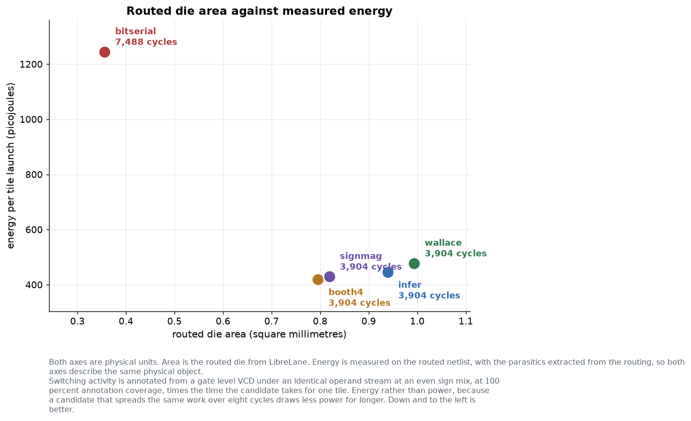

Both axes are physical and both are post-route: routed die area against energy per tile
launch measured on the routed netlist. Energy rather than power, for the reason above.

Reading it: `engine_booth4` and `engine_bitserial` are the only two candidates on the
frontier. Booth is the best single-cycle design on every axis at once. Bit-serial buys a
2.2x smaller die for 2.6x the energy and 1.92x the cycles, which is the right trade only
when area is the binding constraint. The other three are all dominated by Booth: bigger,
slower and no cheaper. `engine_wallace` is dominated by every other single-cycle
candidate including the one that was written with `*`.

### Whole chip

| Scope | Cells | Flip-flops |
|---|---|---|
| `engine_array` (all five candidates plus gating and isolation) | 232,071 | 2,841 |
| `bench_core` | 412,685 | 85,577 |
| `gemm_bench_chip` | 412,687 | 85,577 |

`engine_array` is 232,071 generic cells against 174,298 for the five candidates on their
own. On the real process the same comparison is **2,233,332 um2 against 1,665,153 um2, a
34 percent overhead**. That difference is the clock gating and operand isolation that
makes the measurement valid, charged to shared logic rather than to any candidate. A
production accelerator with one datapath would not pay it, and it is the price of putting
five datapaths on one die so they can be compared under identical conditions.

That 34 percent is a **synthesis** cell-area ratio at the typical corner, and it is the
only cell-area ratio in this section. `engine_array` has since completed place and route,
and the result is the reason it is reported separately from the five candidates rather
than in the same table: **it routes, it is LVS clean, and it does not pass DRC signoff.**

| metric | `engine_array`, post route |
| --- | --- |
| die area | 3,814,860 um2, 3.815 mm2 |
| standard cell area | 1,903,440 um2, 51.0% core utilisation |
| routed wirelength | 9,438,759 um |
| worst setup slack | +0.143 ns, met with almost no margin |
| total power | 388 mW |
| LVS errors | 0 |
| router DRC | 0 |
| **Magic DRC** | **12** |
| **KLayout DRC** | **2** |
| **max capacitance violations** | **15** |

Every one of the five candidates signs off clean on its own. Assembled onto one die with
its clock gates and operand isolation, the same logic does not. That is the finding worth
taking from this section: per-block signoff does not imply chip signoff, and the
integration wrapper is where it breaks. The 14 DRC errors and 15 max-cap violations are
real and unfixed, so **no `engine_array` row appears in the comparison tables and its
numbers must not be read as a signed-off result.** It is roughly four times the routing
problem of the largest candidate, handing OpenROAD 1,167,004 routing guides against
288,273, and the single-threaded Magic DRC signoff scales the same way.

Its configuration is committed, so
`tools/run_pnr.py --tops engine_array` reproduces the run, and fixing the violations is
the obvious next piece of work for anyone forking this.

The flip-flop count jumps at `bench_core` because Yosys maps the four matrix stores
(74 kbit in total) to flip-flops: this build binds no SRAM macros. A macro-backed build
replaces those with four compiled SRAM cuts at a fraction of the area.
`rtl/lib/sram_1rw.sv` is the binding point.

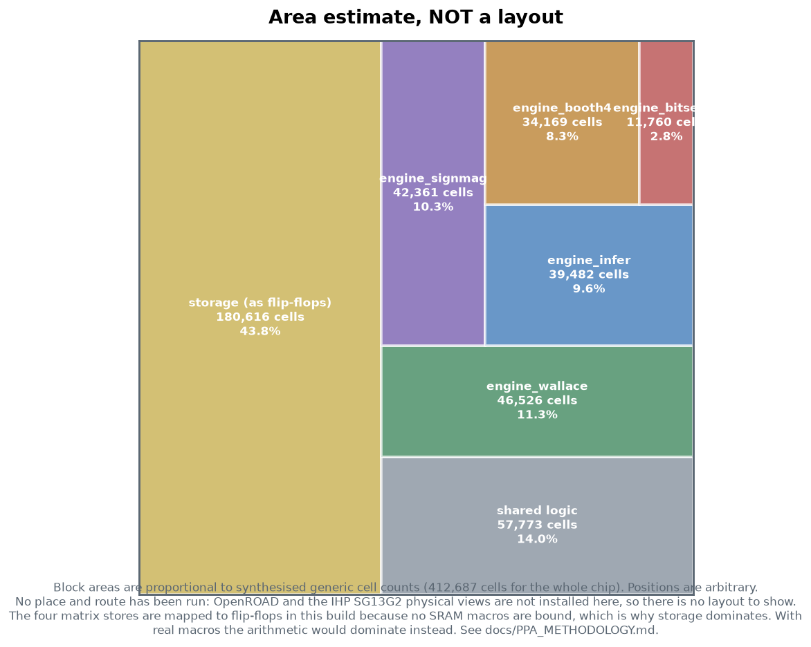

**That figure is an area estimate, not a layout.** Block sizes are proportional to
synthesised cell counts and the positions are arbitrary. The real layouts are the contact
sheets above. The whole-chip flow, with its pad ring and SRAM macros, has never been run:
every routed number here is a candidate, not the chip.

---

## Verification

Everything below genuinely ran, on Icarus Verilog 12.0 through cocotb 2.0.1.

| Suite | Result | Scale |
|---|---|---|
| `test_engine_exact` | 6/6 pass | 2,000 randomised tile launches across five operand distributions = 10,000 candidate evaluations and 160,000 element comparisons, plus 11 INT8 corner cases |
| `test_engine_equiv` | 3/3 pass | 20,000 candidate pair comparisons (10 pairs x 2,000 launches), 110 corner comparisons, 8,192 multiplier operand pairs |
| `test_config` | 2/2 pass | geometry read back out of the chip and compared against the Python model |
| `test_spi_protocol` | 16/16 pass | every opcode, 11 unknown opcodes, 7 truncated frames, a mid-byte frame, offset writes, address range violations, 48 back-to-back frames, commands during a run, soft reset, four SPI clock ratios |
| `test_end_to_end` | 6/6 pass | full 4 KiB result readback checked element by element, on-chip comparator agreement, 6 deliberately corrupted reference elements all localised, all five candidates through the whole chip |
| `test_perf_counters` | 5/5 pass | measured cycles equal the analytic model exactly for every candidate, MAC count exactly 32,768, cycle count data independent |
| `test_tiling` | 5/5 pass | coordinate-dependent operands, 6 single-tile positions, all 8 K tiles proved to contribute exactly once on every candidate, boundary tiles, repeated-run idempotence |
| `test_reset_gating` | 6/6 pass | reset state, reset mid-run, per-candidate clock gating, operand isolation, test mode, candidate switching |
| Verilator lint | 0 warnings | `-Wall` on the chip with no waivers of any kind, and on the engine harness with `UNUSEDPARAM` waived because that verification-only top uses none of the host-interface constants |
| Yosys synthesis | pass | 8 tops, no inferred latches, `check -assert` clean, no blackboxes |
| Gate level equivalence | pass | all five synthesised netlists checked against a reference before their activity is counted |
| Post-route functional | pass | LibreLane's final netlist, the one the GDS was streamed from, simulated against the reference model with the PDK's own cell models |

Total: 49 cocotb tests, all passing.

That last row matters more than its size suggests. A power number taken from a netlist
that computes the wrong answer is worthless, so `tools/verify_routed.py` checks every
output element of every tile against NumPy on the routed netlist *before* its activity is
counted, and reports its annotation coverage so a partly-synthetic number cannot pass as
a measured one.

```bash
make lint          # Verilator -Wall, must be zero warnings
make sim           # the full suite
make sim-quick     # reduced sweep, what CI runs
make verify-routed # simulate the routed netlist and measure its power
```

The reference model is NumPy with an explicit INT64 accumulator wrapped to INT32. It does
not mirror RTL structure, so a shared misunderstanding cannot make a test pass.
Cross-candidate equivalence is checked separately, because a common-mode error in the
model would pass every comparison against it. The full plan is in
[docs/VERIFICATION_PLAN.md](docs/VERIFICATION_PLAN.md).

---

## Control plane

SPI Mode 0, MSB first, chip select active low, `f_spi <= f_core/8`. The pins are
oversampled in the core clock domain rather than used as a clock, so the whole chip is
single-clock and there is no clock domain crossing to verify.

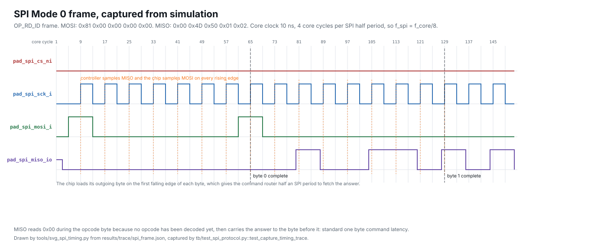

That waveform is a real captured frame: `test_capture_timing_trace` samples the pins on
every core clock edge and writes `results/trace/spi_frame.json`, and the figure is drawn
from that file.

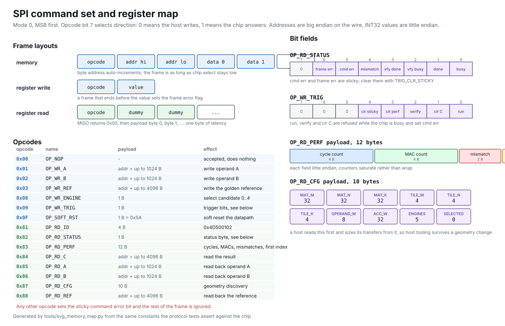

Fifteen opcodes cover loading operands and a golden reference, selecting a candidate,
clearing, triggering, verifying, reading the result, reading the performance counters and
the status byte, geometry discovery, and a keyed soft reset. Errors are reported rather
than swallowed: unknown opcodes, out-of-range addresses, truncated frames and commands
issued while busy all set sticky status bits. Full table in
[docs/MEMORY_MAP.md](docs/MEMORY_MAP.md).

`OP_RD_CFG` returns the build's geometry, so host tooling sizes its transfers from the
chip rather than from a compile-time constant. A fork that changes `MAT_*` or `TILE_*`
does not need to change its host software.

---

## Dataflow

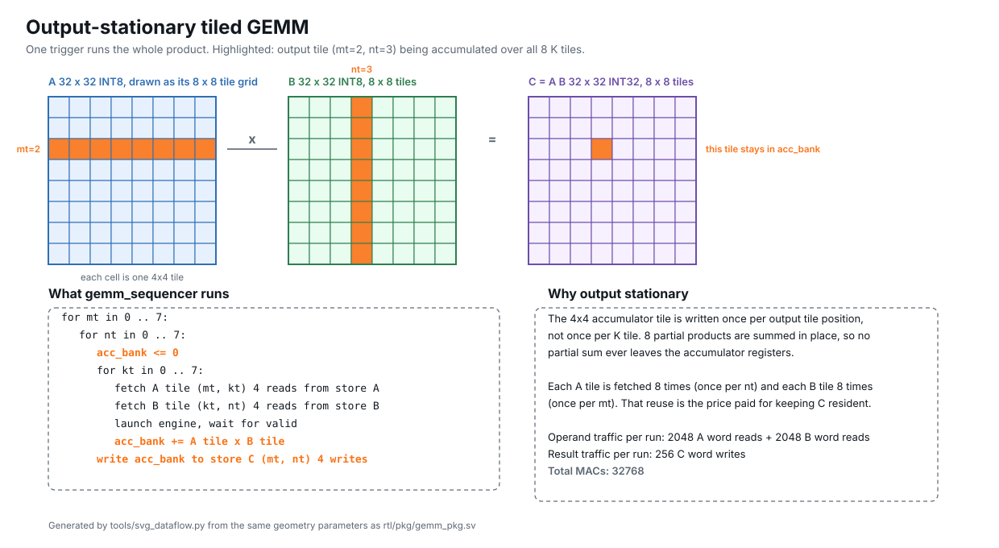

One trigger runs the whole product. The accumulator for each output tile stays resident
while all `GRID_K` K-tiles stream through it, so no partial sum ever leaves the
accumulator registers.

The operand SRAM words are cut so that one word is exactly the slice of a matrix row a
tile fetch needs, which makes a tile fetch `TILE_M` (or `TILE_K`) single-port reads rather
than one implausibly wide access. Five of the seven cycles per K-tile are operand fetch,
and that cost is real: a design that pretends a single-port SRAM has a wide port measures
a memory system that cannot be built.
[docs/ARCHITECTURE.md](docs/ARCHITECTURE.md) has the rest.

---

## Adding your own candidate

This repository is a harness, and dropping a sixth microarchitecture into it is meant to
be mechanical. Five files change and nothing else in the design needs to know your
candidate exists.

```bash
cp rtl/engines/engine_template.sv rtl/engines/engine_mine.sv
sed -i 's/engine_template/engine_mine/' rtl/engines/engine_mine.sv
make lint-template          # the skeleton is kept lint clean on purpose
```

`rtl/engines/engine_template.sv` is a complete, lint-clean, working single-cycle candidate
with the arithmetic factored out behind a marked block. It is deliberately absent from
`rtl/filelist.f`, so it never reaches a measurement until you add it. As written it
computes the right answer with an inferred multiply, which means it will pass every
correctness test and tell you nothing: the point is to start from a known-good baseline
rather than from a blank file.

Once it is in the filelist, every measurement in this README applies to it automatically:
the test suite will check it against the reference model and against every other
candidate, the sweeps will include it, and `tools/run_pnr.py` will route it at the same
constraint as everything else. The full contract, including the exact port list and the
five files, is in [docs/ADDING_A_CANDIDATE.md](docs/ADDING_A_CANDIDATE.md).

---

## Running everything

```bash
git clone https://github.com/danieltyukov/matmul-ppa-testchip.git
cd matmul-ppa-testchip
make venv           # .venv with cocotb, numpy, matplotlib
make check-tools    # reports what is present and what is missing
make lint sim       # lint and the full test suite
make synth power    # area and the switching-activity proxy
make images         # regenerate every figure from results/
```

Needed, and verified working: Verilator 5.020 (lint), Icarus Verilog 12.0 (simulation),
Yosys 0.33 (synthesis), Python 3.12.

Verilator would be the faster cocotb backend, but cocotb 2.0 requires Verilator 5.036 and
the toolchain here is 5.020, so Icarus runs the tests and Verilator does lint. Setting
`SIM=verilator` in `tb/Makefile` is the only change needed once a newer Verilator is
available.

### With the IHP PDK

```bash
tools/fetch_pdk.sh        # sparse clone of the views the flow needs
source pdk/env.sh
make synth-pdk            # real cell area in square micrometres
make pdk-ppa              # path delay and watts with real switching activity
make pnr                  # place and route every candidate to a signed-off GDS
make verify-routed        # simulate the routed netlist, measure its power
make layout               # render the GDS and build the contact sheets
```

`tools/fetch_pdk.sh` does not vendor the PDK. It is a large Apache-2.0 third-party
artefact with its own release cadence, and a committed copy would go stale.

`make pnr` is the expensive one: a full LibreLane Classic flow per candidate, including
Magic and KLayout DRC, LVS, antenna, slew and capacitance signoff. Set `PNR_THREADS` to
suit the machine. The Makefile defaults it from `nproc`, because LibreLane leaves
`KLAYOUT_DRC_THREADS` and `KLAYOUT_XOR_THREADS` unset and those two stages dominate wall
time when they run single-threaded.

### What needs the PDK

| Target | Needs the PDK | Status here |
|---|---|---|
| `make lint` | no | run, zero warnings |
| `make sim` | no | run, 49 tests pass |
| `make synth` | no | run, reports committed |
| `make power` | no | run, results committed |
| `make images` | no | run, figures committed |
| `make synth-pdk` | yes | run, results committed under `results/synth/sg13g2/` |
| `make pdk-ppa` | yes | run, results committed under `results/pdk/` |
| `make pnr` | yes, plus LibreLane | run, results committed under `results/pnr/` |
| `make verify-routed` | yes, plus LibreLane | run, results committed |
| `make layout` | yes, plus KLayout | run, renders committed |
| `make flow` (whole chip) | yes, plus OpenROAD | **not run** |

---

## Repository layout

```
rtl/
  pkg/        gemm_pkg.sv, the single source of truth for every dimension
  lib/        synchroniser, reset bridge, clock gate, SRAM technology wrapper
  host/       spi_target, frame_router
  mem/        matrix_store: word and byte views on one single-port SRAM
  engines/    the five candidates, plus the shared CSA tree and accumulator bank
  seq/        gemm_sequencer, engine_array
  measure/    cycle_meter, mac_meter, result_checker
  top/        bench_core, pad_frame, gemm_bench_chip
tb/           cocotb suite, the NumPy reference model, the SPI driver, SV benches
tools/        synthesis collection, VCD activity proxy, figure generators, the
              LibreLane driver, the routed-netlist verifier, the GDS renderer,
              and program_chip.py: the host driver for packaged silicon
flow/         Yosys script, the PDK-gated OpenROAD sequence, LibreLane configs
constraints/  clocks, IO and area SDC
results/      every measurement the README and the figures are built from
docs/         architecture, memory map, PPA methodology, verification plan,
              and the guide for adding your own candidate
```

## Bringing up silicon

`tools/program_chip.py` drives the packaged chip from Linux spidev with the same command
sequences the tests use, sharing its frame construction with the testbench through
`tb/gemm_model.py` so a protocol change cannot make the two disagree silently.

```bash
tools/program_chip.py info                    # identify the chip, report its geometry
tools/program_chip.py bench --engine 1        # one candidate, checked on chip
tools/program_chip.py sweep --clock-hz 50e6   # every candidate, PPA table
tools/program_chip.py read-c --out result.npy
```

It has never been run against silicon, because nothing has been fabricated.

## Documentation

- [docs/ARCHITECTURE.md](docs/ARCHITECTURE.md): the design, and why each decision was taken
- [docs/MEMORY_MAP.md](docs/MEMORY_MAP.md): the SPI command set, register maps and worked sequences
- [docs/PPA_METHODOLOGY.md](docs/PPA_METHODOLOGY.md): how every number is produced and what it does not mean
- [docs/VERIFICATION_PLAN.md](docs/VERIFICATION_PLAN.md): every test and what it establishes
- [docs/ADDING_A_CANDIDATE.md](docs/ADDING_A_CANDIDATE.md): drop in your own microarchitecture
- [CONTRIBUTING.md](CONTRIBUTING.md)

## Honesty notes

Collected in one place, because a benchmark repository that overstates its numbers is
worse than no benchmark at all.

- **Nothing has been fabricated.** The layouts are routed GDS from LibreLane, signed off
  against DRC and LVS. No mask has been made and no silicon exists.
- **The whole-chip flow has never been run.** Every routed number here is a candidate
  block. `gemm_bench_chip`, with its pad ring and SRAM macros, has not been through place
  and route at all.
- **`engine_array` has no routed result.** Its place and route was attempted and did not
  complete in the time available. The 34 percent integration overhead is therefore a
  synthesis cell-area ratio, not a die-area one.
- **Synthesis area and routed area are different numbers** and are labelled apart
  everywhere. Yosys generic cell counts are not PDK area; PDK cell area is not die area.
- **Gate equivalents are not area, and logic depth is not delay.** Both are counts.
- **The synthesis frequency column is not a frequency.** It is limited by an unbuffered
  512-load net that place and route removes, and it is included only to show that.
- **A transition count is not power.** Where both exist they are reported side by side,
  and they disagree by about a factor of two on the headline comparison. The proxy's
  biases, glitch power chief among them, are listed in the methodology document.
- **The gate level simulation is zero-delay,** at synthesis and after routing, because
  Icarus needs the PDK's specify blocks stripped. No glitch power is counted anywhere in
  this repository, which systematically flatters deep combinational designs.
- **`power__total` in `results/pnr/summary.json` is not measured power.** It is
  OpenROAD's estimate at its default switching activity, roughly five times the annotated
  figure. The measured number is in `results/pnr/routed_power.json`.
- **The sign-magnitude result is a qualified one.** Against the identical two's
  complement datapath it is worth 17 percent of area and 10 percent of energy after
  routing, and costs 11 percent of frequency. At a fixed clock on the synthesis netlist
  it is a 13.5 percent power win on all-negative operands and a 4.2 percent loss on
  all-positive ones. It is beaten outright by `engine_booth4`.
- **Place and route here is bit-reproducible, and that was checked rather than assumed.**
  The same candidate routed twice from the identical configuration matched on all 191
  metrics. An earlier 67.1 MHz figure for that candidate came from a superseded SDC whose
  IO budget scaled with the clock period, not from tool variance.
- **The switching-activity proxy ranks the two frontier candidates the wrong way round**
  once their real routed energy is measured. It is a screen, not a decision procedure.

## Licence

Apache-2.0. Copyright 2026 Daniel Tyukov. See [LICENSE](LICENSE).
